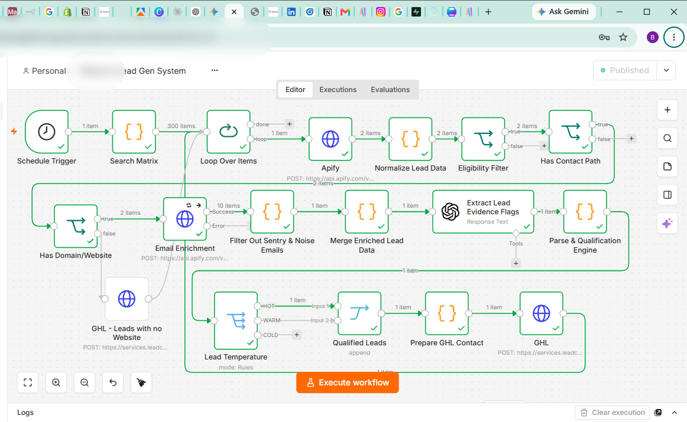

# medvora-lead-gen-automation
Highly optimized and targeted end-to-end B2B lead generation pipeline built with n8n, Apify, OpenAI API, and GoHighLevel.


# Medvora Lead Gen System: Automated B2B Prospecting & AI Qualification Pipeline

An automated, scalable B2B lead generation and qualification pipeline engineered with **n8n**, **Apify**, **OpenAI (GPT-4o)**, and **GoHighLevel (GHL)**. 

This system automates the entire outbound sourcing cycle—from localized directory scraping and multi-channel enrichment to AI-driven temperature scoring and CRM synchronization—eliminating manual data entry.

---

## 🏗️ Architecture & Workflow Overview



### Sourcing & Data Extraction Matrix
* **Scheduled Execution:** Triggered via cron schedule to execute automated batch runs.
* **Search Matrix:** Rotates target niches across defined geographical locations.
* **Apify Actor Scraping:** Scrapes business profile data from Google Maps and web directories, extracting names, domain paths, phone numbers, addresses, and social links.

### Data Normalization & Eligibility Filtering
* **Batch Processing:** Loops through incoming raw payload items (`Loop Over Items`).
* **Eligibility Filter:** Filters out incomplete records and checks key fields (such as contact presence and review thresholds).
* **Multi-Branch Routing:** Drops uncontactable entries and routes leads missing website domains directly to lightweight CRM contact creation.

### Email Enrichment & Noise Reduction
* **Targeted Web Scrape:** Scrapes primary domains to discover unlisted contact emails.
* **Sentry & Noise Cleanup:** Strips out automated logging emails, framework error tracks (Sentry), and generic service accounts.

### AI Qualification Engine
* **Prompt-Engineered LLM Evaluation:** Uses OpenAI to evaluate target lead metadata against custom Ideal Customer Profile (ICP) evidence flags.
* **Temperature Scoring:** Dynamically categorizes prospects into **HOT**, **WARM**, or **COLD** tiers based on buying intent indicators.

### CRM Ingestion & Deduplication
* **GoHighLevel API Integration:** Upserts qualified contact payloads directly into GoHighLevel custom fields via `/contacts/upsert`.
* **Automatic Deduplication:** Matches incoming records on `email` and `phone` to update existing records without creating duplicates.
* **User & Tag Assignment:** Assigns contacts to specific sales user IDs and attaches campaign tags for team follow-ups.

---

## 🛠️ Tech Stack

* **Orchestration:** n8n Cloud
* **Scraping & Data Extraction:** Apify API (Google Maps & Email Extractors)
* **AI & NLP:** OpenAI API (GPT-4o / JSON Mode)
* **CRM:** GoHighLevel API (`services.leadconnectorhq.com`)
* **Languages & Formats:** JavaScript / Node.js expressions, JSON payload transformations

---

## ⚙️ How to Deploy

1. Clone this repository:
   ```bash
   git clone [https://github.com/YOUR_USERNAME/medvora-lead-gen-automation.git](https://github.com/YOUR_USERNAME/medvora-lead-gen-automation.git)
